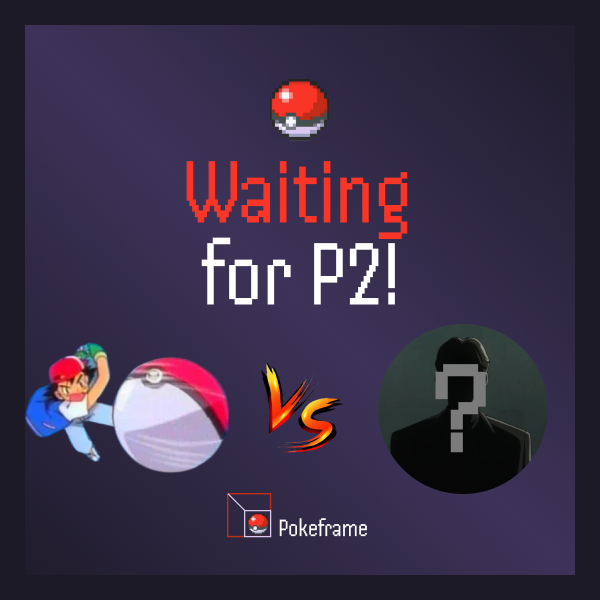

# PokeFrames - ETH Online 2024

Welcome to PokeFrames, a Pokémon Battle Simulation Game! This project is a blockchain-based game built using **Farcaster Frames**. Players can mint their Pokémon and engage in battles against other players, leveraging blockchain technology to ensure a secure and verifiable gaming experience.

## Introduction

The Pokémon Battle Simulation Game combines the nostalgic fun of Pokémon battles with the innovative technology of blockchain. Players can mint their unique Pokémon NFTs and battle against other players in a secure and verifiable environment, thanks to the power of Farcaster Frames.

## Features

- **Mint Pokémon NFTs**: Players can mint their own Pokémon as unique NFTs.
- **Battle Other Players**: Engage in turn-based battles with other players.
- **Secure and Verifiable**: All battle data and player transactions are securely stored on the blockchain.
- **Battle Logs**: Battle logs are stored on the blockchain, providing a transparent and tamper-proof record of all battles.

## How It Works

The game is built using a secure and decentralized environment for the game mechanics. Here's a high-level overview of how the game works:

1. **Minting Pokémon**: Players can mint their Pokémon using the Farcaster Frames interface, creating unique NFTs representing their Pokémon.
2. **Initiating a Battle**: Players can challenge each other to battles. Each player's moves and strategies are executed in a turn-based format.
3. **Battle Logs**: All battle logs are stored on the blockchain, ensuring transparency and preventing tampering with battle outcomes.

### Prerequisites

- [Node.js](https://nodejs.org/)
- [Farcaster Frames](https://farcaster.xyz/)

## Media and Photos

